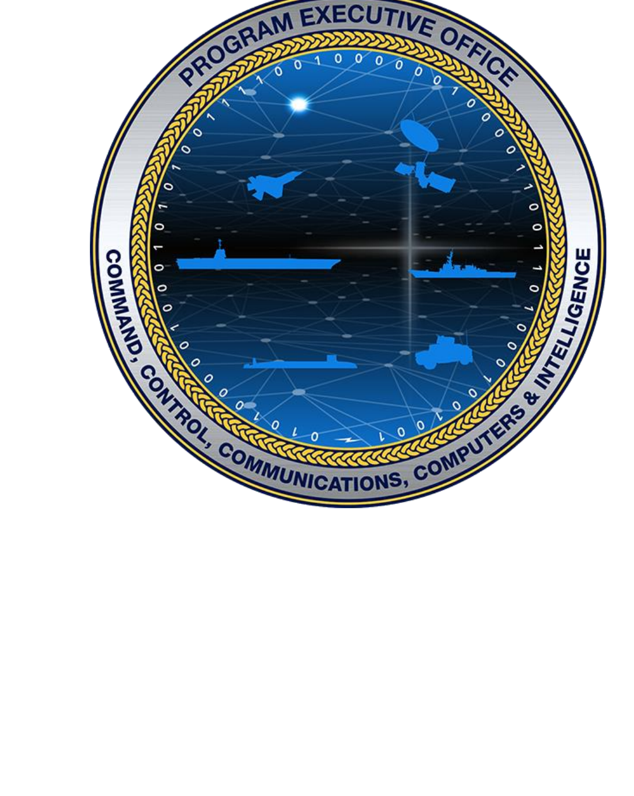

```{=html}
<style>
.peo-hero {
  position: relative;
  width: 100%;
  min-height: 420px;
  background-image: url("quarto/assets/hero-carrier.png");
  background-size: cover;
  background-position: center 30%;
  display: flex;
  align-items: center;
  justify-content: center;
  margin-bottom: 2.5rem;
}
.peo-hero-overlay {
  position: absolute;
  inset: 0;
  background: linear-gradient(
    135deg,
    rgba(10, 36, 71, 0.88) 0%,
    rgba(10, 36, 71, 0.70) 100%
  );
}
.peo-hero-content {
  position: relative;
  z-index: 1;
  text-align: center;
  padding: 2.5rem 1rem;
}
.peo-hero-content img {
  height: 140px;
  margin-bottom: 1.2rem;
  filter: drop-shadow(0 4px 12px rgba(0,0,0,0.6));
}
.peo-hero-content h1 {
  color: #ffffff;
  font-size: 2rem;
  font-weight: 700;
  letter-spacing: 0.04em;
  margin: 0 0 0.3rem;
  border: none;
  text-shadow: 0 2px 8px rgba(0,0,0,0.5);
}
.peo-hero-content .subtitle {
  color: #c8a951;
  font-size: 0.95rem;
  letter-spacing: 0.12em;
  text-transform: uppercase;
  font-weight: 600;
  text-shadow: 0 1px 4px rgba(0,0,0,0.5);
}

.report-grid {
  display: grid;
  grid-template-columns: repeat(auto-fit, minmax(280px, 1fr));
  gap: 1.2rem;
  margin-top: 0.5rem;
}
.report-card {
  border: 1px solid #c0cce0;
  border-radius: 6px;
  padding: 1.1rem 1.3rem;
  border-top: 3px solid #0a2447;
  background: #fff;
  transition: box-shadow 0.15s, border-top-color 0.15s;
}
.report-card:hover {
  box-shadow: 0 4px 16px rgba(10,36,71,0.12);
  border-top-color: #c8a951;
}
.report-card h3 {
  font-size: 0.78rem;
  font-weight: 700;
  letter-spacing: 0.1em;
  text-transform: uppercase;
  color: #c8a951;
  margin: 0 0 0.6rem;
  border: none;
}
.report-card ul {
  list-style: none;
  padding: 0;
  margin: 0;
}
.report-card ul li {
  padding: 0.22rem 0;
  border-bottom: 1px solid #f0f3f8;
  font-size: 0.875rem;
}
.report-card ul li:last-child {
  border-bottom: none;
}
.report-card ul li a {
  color: #1a3a6b;
  text-decoration: none;
  font-weight: 500;
}
.report-card ul li a:hover {
  color: #c8a951;
}
</style>

<div class="peo-hero">
  <div class="peo-hero-overlay"></div>
  <div class="peo-hero-content">
    
    <h1>Portfolio Reports</h1>
    <div class="subtitle">Program Executive Office · C4I &amp; Networks</div>
  </div>
</div>

<div class="report-grid">

  <div class="report-card">
    <h3>Executive</h3>
    <ul>
      <li><a href="quarto/health-dashboard.html">Portfolio Health Dashboard</a></li>
      <li><a href="quarto/risk-register.html">Risk Register</a></li>
      <li><a href="quarto/wsjf.html">WSJF Priority Board</a></li>
      <li><a href="quarto/portfolio.html">SAFe Portfolio Hierarchy</a></li>
    </ul>
  </div>

  <div class="report-card">
    <h3>Program</h3>
    <ul>
      <li><a href="quarto/blocking.html">Blocking &amp; Cross-ART Risk</a></li>
      <li><a href="quarto/epic-lifecycle.html">Epic Lifecycle</a></li>
      <li><a href="quarto/pi-predictability.html">PI Predictability</a></li>
      <li><a href="quarto/art-capacity-balance.html">ART Capacity Balance</a></li>
      <li><a href="quarto/piid-project.html">Program × PI Matrix</a></li>
      <li><a href="quarto/piid-project-detail.html">Program PI Detail</a></li>
      <li><a href="quarto/workload.html">ART-Team Workload</a></li>
      <li><a href="quarto/flow-metrics.html">Flow Metrics</a></li>
    </ul>
  </div>

  <div class="report-card">
    <h3>Data Quality</h3>
    <ul>
      <li><a href="quarto/unassigned-pi.html">Unassigned PI</a></li>
      <li><a href="quarto/orphan-epics.html">Orphaned Epics</a></li>
      <li><a href="quarto/orphan-issues.html">Orphaned Issues</a></li>
      <li><a href="quarto/premature-closures.html">Premature Closures</a></li>
    </ul>
  </div>

</div>
```
