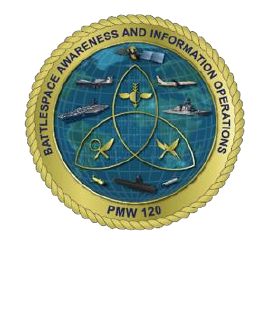

```{=html}
<style>
/* ── Page header ── */
.pmw-header {
  display: flex;
  align-items: center;
  gap: 1.4rem;
  padding: 1.6rem 0 1.2rem;
  border-bottom: 3px solid #c8a951;
  margin-bottom: 1.6rem;
}
.pmw-header img {
  height: 110px;
  flex-shrink: 0;
}
.pmw-header .pmw-titles {
  flex: 1;
}
.pmw-header .pmw-titles .org-line {
  font-size: 0.72rem;
  font-weight: 700;
  letter-spacing: 0.14em;
  text-transform: uppercase;
  color: #c8a951;
  margin-bottom: 0.15rem;
}
.pmw-header .pmw-titles h1 {
  font-size: 1.55rem;
  font-weight: 700;
  color: #0a2447;
  margin: 0 0 0.2rem;
  border: none;
  padding: 0;
  line-height: 1.2;
}
.pmw-header .pmw-titles .mission-line {
  font-size: 0.85rem;
  color: #4a5a70;
  font-style: italic;
}

/* ── Intro block ── */
.pmw-intro {
  background: #f4f7fb;
  border-left: 4px solid #0a2447;
  border-radius: 0 4px 4px 0;
  padding: 0.9rem 1.2rem;
  margin-bottom: 1.8rem;
  font-size: 0.9rem;
  color: #2a3a50;
  line-height: 1.65;
}
.pmw-intro strong {
  color: #0a2447;
}

/* ── Report table ── */
.report-table-wrap {
  overflow-x: auto;
}
.report-table {
  width: 100%;
  border-collapse: separate;
  border-spacing: 0;
  font-size: 0.875rem;
}
.report-table th {
  background-color: #0a2447;
  color: #ffffff;
  font-weight: 700;
  font-size: 0.78rem;
  letter-spacing: 0.09em;
  text-transform: uppercase;
  padding: 0.6rem 1rem;
  border-bottom: 3px solid #c8a951;
  text-align: left;
}
.report-table th:not(:last-child) {
  border-right: 1px solid #1a3a6b;
}
.report-table td {
  padding: 0.38rem 1rem;
  vertical-align: top;
  border-bottom: 1px solid #e8edf5;
  border-right: 1px solid #e8edf5;
  color: #2a3a50;
}
.report-table td:last-child {
  border-right: none;
}
.report-table tr:last-child td {
  border-bottom: none;
}
.report-table tr:nth-child(even) td {
  background-color: #f7f9fc;
}
.report-table a {
  color: #1a3a6b;
  text-decoration: none;
  font-weight: 500;
}
.report-table a:hover {
  color: #c8a951;
  text-decoration: underline;
}
.report-table td.empty {
  color: transparent;
}
.report-table-wrap {
  border: 1px solid #c0cce0;
  border-radius: 6px;
  overflow: hidden;
}
</style>

<div class="pmw-header">
  
  <div class="pmw-titles">
    <div class="org-line">PEO C4I &nbsp;·&nbsp; Program Executive Office, Command, Control, Communications, Computers &amp; Intelligence</div>
    <h1>PMW 120 — Battlespace Awareness &amp; Information Operations</h1>
    <div class="mission-line">SAFe Portfolio Report Dashboard &nbsp;·&nbsp; Data refreshed via GitLab CI</div>
  </div>
  
</div>

<div class="pmw-intro">
  <strong>PMW 120</strong> delivers battle-tested command, control, and intelligence capabilities across Navy and joint programs.
  These reports provide real-time visibility into epic health, delivery risk, and capacity across active Program Increments.
  Data is sourced directly from GitLab and refreshed on each CI pipeline run.
  Use the <strong>Executive</strong> reports for portfolio-level status, <strong>Program</strong> reports for ART and PI-level detail,
  and <strong>Data Quality</strong> reports to identify labeling and hierarchy gaps before PI planning.
</div>

<div class="report-table-wrap">
<table class="report-table">
  <thead>
    <tr>
      <th>Executive</th>
      <th>Program</th>
      <th>Data Quality</th>
    </tr>
  </thead>
  <tbody>
    <tr>
      <td><a href="quarto/health-dashboard.html">Portfolio Health Dashboard</a></td>
      <td><a href="quarto/blocking.html">Blocking &amp; Cross-ART Risk</a></td>
      <td><a href="quarto/unassigned-pi.html">Unassigned PI</a></td>
    </tr>
    <tr>
      <td><a href="quarto/risk-register.html">Risk Register</a></td>
      <td><a href="quarto/epic-lifecycle.html">Epic Lifecycle</a></td>
      <td><a href="quarto/orphan-epics.html">Orphaned Epics</a></td>
    </tr>
    <tr>
      <td><a href="quarto/wsjf.html">WSJF Priority Board</a></td>
      <td><a href="quarto/pi-predictability.html">PI Predictability</a></td>
      <td><a href="quarto/orphan-issues.html">Orphaned Issues</a></td>
    </tr>
    <tr>
      <td><a href="quarto/portfolio.html">SAFe Portfolio Hierarchy</a></td>
      <td><a href="quarto/art-capacity-balance.html">ART Capacity Balance</a></td>
      <td><a href="quarto/premature-closures.html">Premature Closures</a></td>
    </tr>
    <tr>
      <td class="empty">—</td>
      <td><a href="quarto/piid-project.html">Program × PI Matrix</a></td>
      <td class="empty">—</td>
    </tr>
    <tr>
      <td class="empty">—</td>
      <td><a href="quarto/piid-project-detail.html">Program PI Detail</a></td>
      <td class="empty">—</td>
    </tr>
    <tr>
      <td class="empty">—</td>
      <td><a href="quarto/workload.html">ART-Team Workload</a></td>
      <td class="empty">—</td>
    </tr>
    <tr>
      <td class="empty">—</td>
      <td><a href="quarto/flow-metrics.html">Flow Metrics</a></td>
      <td class="empty">—</td>
    </tr>
    <tr>
      <td class="empty">—</td>
      <td><a href="quarto/issue-blocking.html">Issue Blocking</a></td>
      <td class="empty">—</td>
    </tr>
  </tbody>
</table>
</div>
```
